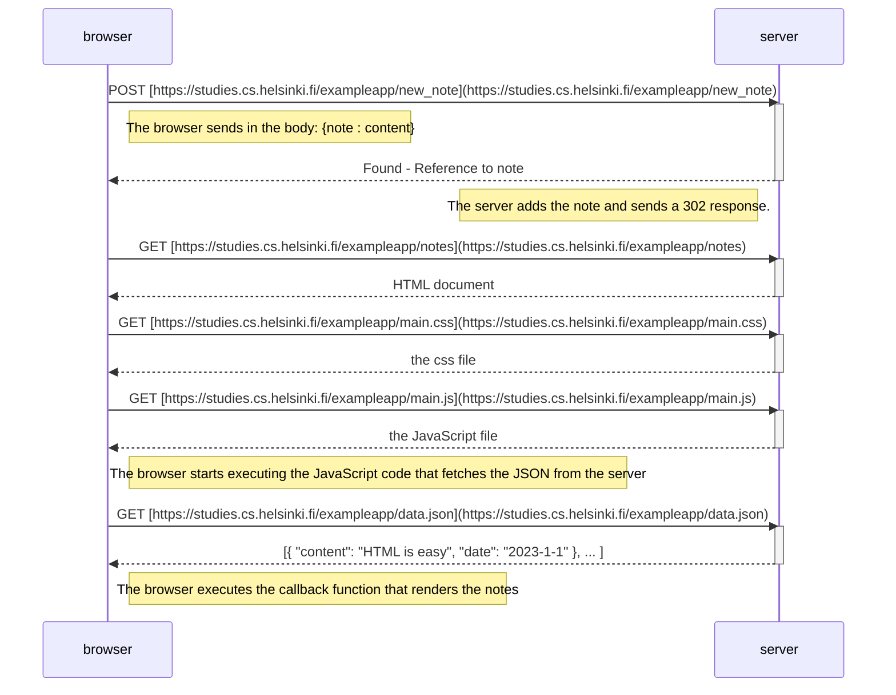
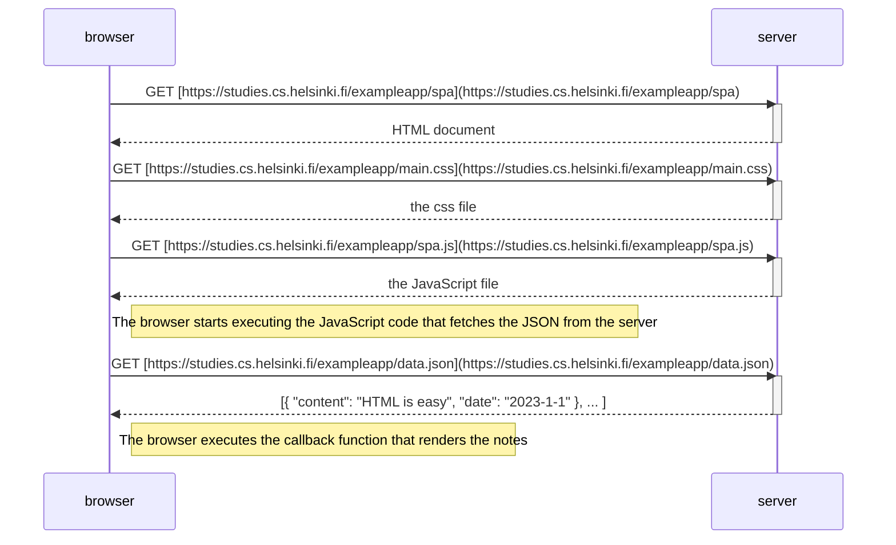
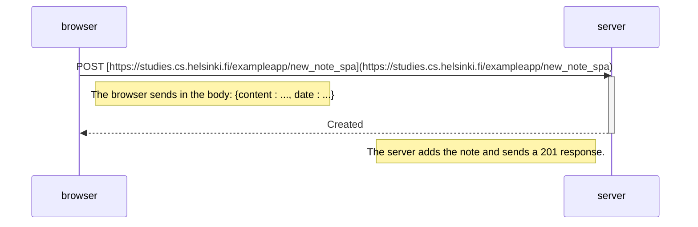

# Part 0 Exercises: Fundamentals of Web Apps

## Exercise 0.4: New Note Diagram (Traditional Web App / MPA)

## Exercise 0.5: Single Page App Diagram (SPA Loading)   

## Exercise 0.6: New Note in Single Page App Diagram (SPA Post)
